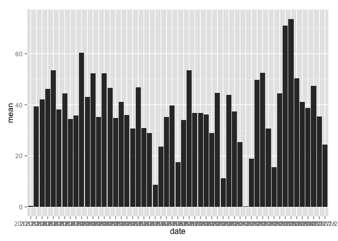

# Reproducible Research: Peer Assessment 1


## Loading and preprocessing the data

```r
library(dplyr)
```

```
## 
## Attaching package: 'dplyr'
## 
## The following objects are masked from 'package:stats':
## 
##     filter, lag
## 
## The following objects are masked from 'package:base':
## 
##     intersect, setdiff, setequal, union
```

```r
library(ggplot2)
unzip("activity.zip")
data <- read.csv("activity.csv")
data <- tbl_df(data)
data <- filter(data, !is.na(steps))
data <- group_by(data,date)
```


## What is mean total number of steps taken per day?

{r}
meow <- summarise(data1,mean(steps),median(steps))
names(meow) <- c("date","mean","median")
g1 <- ggplot(meow,aes(date,mean))
g1 + geom_bar(stat = "identity")

### the total number of steps taken each day is:

```r
data1 <- summarise(data,sum(steps))
data1
```

```
## Source: local data frame [53 x 2]
## 
##          date sum(steps)
##        (fctr)      (int)
## 1  2012-10-02        126
## 2  2012-10-03      11352
## 3  2012-10-04      12116
## 4  2012-10-05      13294
## 5  2012-10-06      15420
## 6  2012-10-07      11015
## 7  2012-10-09      12811
## 8  2012-10-10       9900
## 9  2012-10-11      10304
## 10 2012-10-12      17382
## ..        ...        ...
```

```r
plot(data1)
```

 

### The mean and median of the daily steps are:

```r
meow <- summarise(data,mean(steps),median(steps))
names(meow) <- c("date","mean","median")
g1 <- ggplot(meow,aes(date,mean))
g1 + geom_bar(stat = "identity")
```

 

*the mean of all days is:37.3825996
*The median is: 0

## What is the average daily activity pattern?


## Imputing missing values


## Are there differences in activity patterns between weekdays and weekends?
